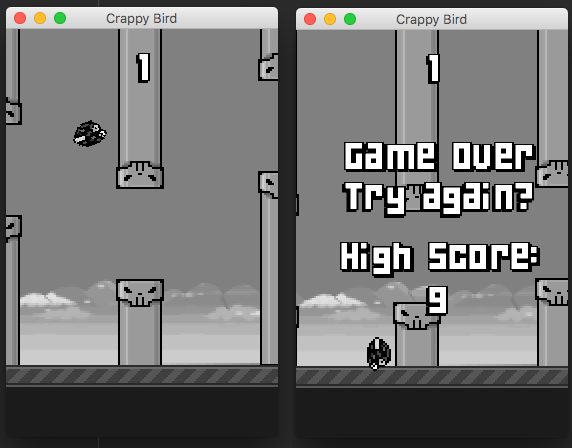

# CrappyBird
Play the game online here:
[https://metalmethod.github.io/CrappyBird/](https://metalmethod.github.io/CrappyBird/)

Flappy Bird clone for fun and to practice Java and learn the libGDX framework.



Based on the great tutorial:
[http://www.kilobolt.com/zombie-bird-tutorial-flappy-bird-remake.html](http://www.kilobolt.com/zombie-bird-tutorial-flappy-bird-remake.html)

to build the webapp:
 ```./gradlew html:dist```